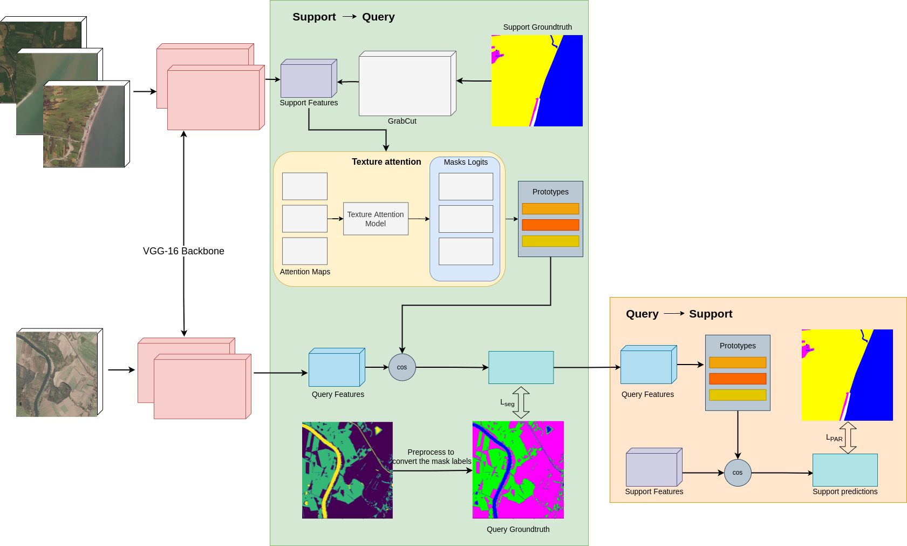

# Texture based Prototypical Network for Few-Shot Semantic Segmentation of Forest Cover: Generalizing for Different Geographical Regions

This work envisages forest identification as a few-shot semantic segmentation task to achieve generalization across different geographical regions. The proposed few-shot segmentation approach incorporates a texture attention module in the prototypical network to highlight the texture features of the forest.

# Dataset
- Train dataset: DeepGlobe challenge
- Test dataset: LandCover AI dataset

Please contact the author of the respective datasets to get access to the datasets/pre-trained models. 

# Dataset Pre-Processing
The train dataset contains 803 images of 2,448 x 2,448 resolution. A mask is provided for each image which contains seven different classes: Urban, Agriculture, Rangeland, Forest, Water, Barren and also an Unknown class.  In this work, the images are tiled to create sub-images of 612 x 612 pixels. This tiling results in 12,800 sub-images. Moreover, the following classes are merged for 1-way task: Urban, Agriculture, Water, Rangeland, Barren and Unknown. 
The input images in train set were resized to (128 x 128) pixels and augmented by randomly flipping the image/mask horizontally.

|:--:| 
| *Overview of the proposed texture-based prototypical network for identifying forests across geographical regions.* |

# Usage instructions:
- Download the pre-trained model and put it under /pretrained_model folder
- Use `config.py` to change the configurations 
- Train using `python3 train.py` / Test using `python3 test.py`

